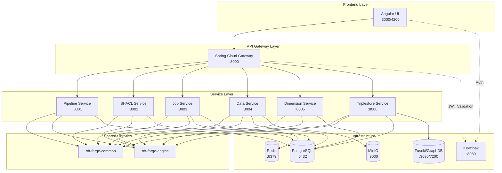

# RDF Forge Architecture Analysis

## Executive Summary

RDF Forge is a microservices-based RDF data platform built with Spring Boot and Java 21. It provides a complete ETL pipeline for RDF data transformation, SHACL validation, and triplestore management. The architecture follows a gateway pattern with multiple specialized backend services.

---

## 1. Current Architecture Overview

### 1.1 Service Inventory

| Service | Port | Description | Dependencies |
|---------|------|-------------|--------------|
| **rdf-forge-gateway** | 8000 | API Gateway with Spring Cloud Gateway | OAuth2/Keycloak |
| **rdf-forge-pipeline-service** | 8001 | Pipeline management REST API | PostgreSQL, rdf-forge-engine |
| **rdf-forge-shacl-service** | 8002 | SHACL shape management & validation | PostgreSQL, Apache Jena |
| **rdf-forge-job-service** | 8003 | Job execution & monitoring | PostgreSQL, Redis |
| **rdf-forge-data-service** | 8004 | Data source & file management | PostgreSQL, MinIO |
| **rdf-forge-dimension-service** | 8005 | Shared dimension management | PostgreSQL |
| **rdf-forge-triplestore-service** | 8006 | Multi-triplestore connector | PostgreSQL, Apache Jena |
| **rdf-forge-ui** | 3000 | Angular 20 frontend | Gateway API |
| **rdf-forge-common** | N/A | Shared models, DTOs, utilities | - |
| **rdf-forge-engine** | N/A | Core ETL engine with Jena & Camel | - |
| **rdf-forge-cli** | N/A | Command-line tool | Spring Shell |

### 1.2 Infrastructure Components

| Component | Image | Port | Purpose |
|-----------|-------|------|---------|
| PostgreSQL | postgres:16-alpine | 5432 | Primary database for all services |
| Redis | redis:7-alpine | 6379 | Job queue and caching |
| MinIO | minio/minio:latest | 9000/9001 | Object storage for data files |
| Fuseki | stain/jena-fuseki:latest | 3030 | Local triplestore for development |
| Keycloak | quay.io/keycloak/keycloak:24.0 | 8080 | Identity & Access Management |

### 1.3 Technology Stack

- **Backend**: Java 21, Spring Boot 3.2.5, Spring Cloud 2023.0.1
- **ETL Engine**: Apache Camel 4.5.0, Apache Jena 5.0.0
- **Database**: PostgreSQL 16 with Flyway migrations
- **Message Queue**: Redis 7
- **Object Storage**: MinIO
- **API Documentation**: SpringDoc OpenAPI 2.5.0
- **Frontend**: Angular 20 with Keycloak-JS
- **Containerization**: Docker with multi-stage builds

---

## 2. Service Architecture Details

### 2.1 Gateway Service (`rdf-forge-gateway`)

The gateway acts as the single entry point for all API requests.

**Key Features:**
- Routes requests to appropriate backend services
- OAuth2 resource server with JWT validation
- Circuit breaker pattern with Resilience4j
- Rate limiting with Bucket4j
- CORS configuration
- Prometheus metrics

**Route Configuration:**
```yaml
routes:
  - /api/v1/pipelines/**, /api/v1/operations/**, /api/v1/templates/** → pipeline-service:8001
  - /api/v1/shapes/**, /api/v1/validation/** → shacl-service:8002
  - /api/v1/jobs/**, /api/v1/schedules/** → job-service:8003
  - /api/v1/data/** → data-service:8004
  - /api/v1/dimensions/**, /api/v1/hierarchies/** → dimension-service:8005
  - /api/v1/triplestores/**, /api/v1/sparql/**, /api/v1/graphs/** → triplestore-service:8006
```

### 2.2 Pipeline Service (`rdf-forge-pipeline-service`)

Manages pipeline definitions and transformations.

**Database Tables:**
- `pipelines` - Pipeline definitions with YAML/JSON configuration
- `pipeline_versions` - Version history for pipelines

### 2.3 Job Service (`rdf-forge-job-service`)

Executes and monitors ETL jobs.

**Key Features:**
- Spring Batch for job execution
- WebSocket support for real-time status updates
- Redis for job queue management
- Async execution with configurable thread pools

**Database Tables:**
- `jobs` - Job execution records
- `job_logs` - Detailed execution logs
- `job_schedules` - Cron-based scheduling

### 2.4 SHACL Service (`rdf-forge-shacl-service`)

Manages SHACL shapes and performs RDF validation.

**Key Features:**
- Shape management with versioning
- On-demand and batch validation
- Template shapes for common use cases

### 2.5 Data Service (`rdf-forge-data-service`)

Handles file uploads and data source management.

**Key Features:**
- MinIO integration for object storage
- Support for CSV, Excel, Parquet, and RDF formats
- File metadata tracking

**MinIO Buckets:**
- `rdf-forge-data` - Source data files
- `rdf-forge-shapes` - SHACL shapes
- `rdf-forge-pipelines` - Pipeline artifacts

### 2.6 Dimension Service (`rdf-forge-dimension-service`)

Manages shared dimensions for cube data.

**Database Tables:**
- `dimensions` - Dimension definitions with URI and hierarchy info

### 2.7 Triplestore Service (`rdf-forge-triplestore-service`)

Connects to and manages multiple triplestores.

**Supported Triplestores:**
- Apache Jena Fuseki
- GraphDB (planned)
- Stardog (planned)

**Database Tables:**
- `triplestore_connections` - Connection configurations
- `cubes` - Published cube metadata

### 2.8 Engine Module (`rdf-forge-engine`)

Core ETL processing library shared by services.

**Key Components:**
- Apache Jena for RDF processing
- Apache Camel for pipeline orchestration
- OpenCSV for CSV parsing
- Apache POI for Excel support
- Apache Parquet for columnar data

### 2.9 CLI Tool (`rdf-forge-cli`)

Command-line interface for headless operations.

**Features:**
- Spring Shell based
- WebFlux client for API communication

---

## 3. Current Authentication Setup

### 3.1 Keycloak Configuration

**Realm:** `rdfforge`

**Clients:**
- `rdf-forge-ui` - Public client for Angular SPA
- `rdf-forge-gateway` - Confidential client for backend

**Roles:**
- `admin` - Full access
- `user` - Standard access

**Pre-configured Users:**
- admin/admin (admin, user roles)
- user/user (user role)

### 3.2 Security Flow

```
┌─────────────┐      ┌──────────────┐      ┌─────────────┐
│   Angular   │──1──▶│   Keycloak   │──2──▶│   Angular   │
│     UI      │◀─────│   (login)    │      │  (token)    │
└─────────────┘      └──────────────┘      └──────┬──────┘
                                                  │3
                                                  ▼
                                           ┌─────────────┐
                                           │   Gateway   │
                                           │  (JWT val)  │
                                           └──────┬──────┘
                                                  │4
                                                  ▼
                                           ┌─────────────┐
                                           │  Services   │
                                           └─────────────┘
```

### 3.3 Current Security State

**Important:** The gateway currently has `anyExchange().permitAll()` in [`SecurityConfig.java`](rdf-forge/rdf-forge-gateway/src/main/java/io/rdfforge/gateway/config/SecurityConfig.java:27), meaning authentication is effectively **disabled** for all routes. This allows development without Keycloak but should be secured for production.

---

## 4. Network Architecture

### 4.1 Docker Network

All services communicate on the default Docker bridge network.

```
┌──────────────────────────────────────────────────────────────┐
│                    Docker Network                             │
│  ┌─────────┐  ┌──────────┐  ┌───────┐  ┌─────────┐          │
│  │ Gateway │  │ Services │  │ Redis │  │ MinIO   │          │
│  │  :8000  │  │:8001-8006│  │ :6379 │  │ :9000   │          │
│  └────┬────┘  └────┬─────┘  └───┬───┘  └────┬────┘          │
│       │            │            │           │                │
│       └────────────┴────────────┴───────────┘                │
│                         │                                     │
│                    ┌────┴────┐                                │
│                    │PostgreSQL│                               │
│                    │  :5432   │                               │
│                    └─────────┘                                │
└──────────────────────────────────────────────────────────────┘
                         │
                    ┌────┴────┐
                    │ Keycloak│
                    │  :8080  │
                    └─────────┘
```

### 4.2 Port Mapping

| Host Port | Container Port | Service |
|-----------|----------------|---------|
| 3000 | 80 | UI (nginx) |
| 8000 | 8000 | Gateway |
| 8001 | 8001 | Pipeline Service |
| 8002 | 8002 | SHACL Service |
| 8003 | 8003 | Job Service |
| 8004 | 8004 | Data Service |
| 8015 | 8005 | Dimension Service (note: host port mismatch) |
| 8006 | 8006 | Triplestore Service |
| 8080 | 8080 | Keycloak |
| 5432 | 5432 | PostgreSQL |
| 6379 | 6379 | Redis |
| 9000 | 9000 | MinIO API |
| 9001 | 9001 | MinIO Console |
| 3030 | 3030 | Fuseki |

---

## 5. Pipeline/Job Execution Flow

```
┌─────────────────────────────────────────────────────────────────┐
│                     Job Execution Flow                          │
│                                                                 │
│  1. User creates/triggers job                                   │
│     │                                                           │
│     ▼                                                           │
│  2. Job Service creates job record (status: PENDING)            │
│     │                                                           │
│     ▼                                                           │
│  3. Job added to Redis queue                                    │
│     │                                                           │
│     ▼                                                           │
│  4. Spring Batch executor picks up job                          │
│     │                                                           │
│     ▼                                                           │
│  5. Engine processes pipeline steps:                            │
│     a. Load data from MinIO/URL                                 │
│     b. Transform using Camel routes                             │
│     c. Convert to RDF using Jena                                │
│     d. Validate against SHACL shapes                            │
│     e. Publish to triplestore                                   │
│     │                                                           │
│     ▼                                                           │
│  6. Job status updated (COMPLETED/FAILED)                       │
│     │                                                           │
│     ▼                                                           │
│  7. WebSocket notification sent to UI                           │
└─────────────────────────────────────────────────────────────────┘
```

---

## 6. Proposed Offline/Online Mode Architecture

### 6.1 Overview

The goal is to support two deployment modes:

1. **Offline Mode**: Full local stack running in Docker for development and isolated environments
2. **Online Mode**: UI connecting to a remote Kubernetes cluster for production workloads

### 6.2 Offline Mode Architecture

```
┌────────────────────────────────────────────────────────────────────┐
│                    OFFLINE MODE (Local Docker)                      │
│                                                                     │
│  ┌─────────────────────────────────────────────────────────────┐   │
│  │                     Local Network                            │   │
│  │  ┌────────┐  ┌─────────┐  ┌─────────┐  ┌─────────────────┐  │   │
│  │  │   UI   │  │ Gateway │  │Services │  │  Infrastructure │  │   │
│  │  │ :4200  │─▶│  :8000  │─▶│:8001-06 │  │ PostgreSQL,Redis│  │   │
│  │  └────────┘  └─────────┘  └─────────┘  │ MinIO, GraphDB  │  │   │
│  │                                         └─────────────────┘  │   │
│  └─────────────────────────────────────────────────────────────┘   │
│                                                                     │
│  Features:                                                          │
│  ✓ No Keycloak - Authentication disabled                           │
│  ✓ GraphDB Free Edition instead of Fuseki                          │
│  ✓ All services run locally                                        │
│  ✓ Single docker-compose up command                                │
│  ✓ Persistent volumes for data                                     │
└────────────────────────────────────────────────────────────────────┘
```

**Offline Configuration Changes:**
- Remove Keycloak container
- Use no-auth profile for gateway
- Replace Fuseki with GraphDB
- Simplified environment variables
- Local file storage option for MinIO

### 6.3 Online Mode Architecture

```
┌────────────────────────────────────────────────────────────────────┐
│                    ONLINE MODE (Kubernetes)                         │
│                                                                     │
│  ┌─────────────────────┐     ┌─────────────────────────────────┐   │
│  │   Local Machine     │     │      Kubernetes Cluster         │   │
│  │                     │     │                                  │   │
│  │  ┌─────────────┐    │     │  ┌──────────┐  ┌────────────┐   │   │
│  │  │   Angular   │    │     │  │ Ingress  │  │ Keycloak   │   │   │
│  │  │     UI      │────┼────▶│  │Controller│  │            │   │   │
│  │  │   :4200     │    │     │  └────┬─────┘  └────────────┘   │   │
│  │  └─────────────┘    │     │       │                          │   │
│  │                     │     │  ┌────┴────────────────────┐    │   │
│  └─────────────────────┘     │  │        Gateway          │    │   │
│                              │  │      (LoadBalancer)      │    │   │
│                              │  └─────────────┬────────────┘    │   │
│                              │                │                  │   │
│                              │  ┌─────────────┴────────────┐    │   │
│                              │  │ Pipeline │ Job  │ SHACL  │    │   │
│                              │  │ Service  │ Svc  │ Service│    │   │
│                              │  └──────────┴──────┴────────┘    │   │
│                              │                                  │   │
│                              │  ┌─────────────────────────────┐ │   │
│                              │  │ PostgreSQL │ Redis │ MinIO  │ │   │
│                              │  │ (Managed)  │(Mngd) │(Mngd)  │ │   │
│                              │  └─────────────────────────────┘ │   │
│                              └──────────────────────────────────┘   │
└────────────────────────────────────────────────────────────────────┘
```

**Online Configuration Features:**
- UI runs locally (ng serve) or as static site
- API calls routed to Kubernetes cluster via Ingress
- Full Keycloak authentication enabled
- Managed database services
- Horizontal scaling for services

### 6.4 Configuration Strategy

#### Environment-Based Configuration

Create environment profiles to switch between modes:

**1. UI Environment Files:**

```typescript
// environment.offline.ts
export const environment = {
  production: false,
  apiBaseUrl: 'http://localhost:8000/api/v1',
  authMode: 'none',  // No authentication
  keycloak: null
};

// environment.online.ts  
export const environment = {
  production: false,
  apiBaseUrl: 'https://api.rdfforge.example.com/api/v1',
  authMode: 'keycloak',
  keycloak: {
    url: 'https://auth.rdfforge.example.com',
    realm: 'rdfforge',
    clientId: 'rdf-forge-ui'
  }
};
```

**2. Gateway Security Profiles:**

```yaml
# application-noauth.yml
spring:
  security:
    enabled: false
  profiles:
    active: noauth

# application-keycloak.yml
spring:
  security:
    oauth2:
      resourceserver:
        jwt:
          issuer-uri: ${KEYCLOAK_ISSUER_URI}
```

**3. Docker Compose Profiles:**

```yaml
# docker-compose.yml with profiles
services:
  keycloak:
    profiles: ["online", "full"]
    # ... config

  graphdb:
    profiles: ["offline", "full"]
    # ... config
```

### 6.5 Making Keycloak Optional

#### Backend Changes Required:

1. **Create NoAuth Security Configuration:**
   ```java
   @Configuration
   @Profile("noauth")
   public class NoAuthSecurityConfig {
       @Bean
       public SecurityWebFilterChain noAuthFilterChain(ServerHttpSecurity http) {
           return http
               .csrf(ServerHttpSecurity.CsrfSpec::disable)
               .authorizeExchange(e -> e.anyExchange().permitAll())
               .build();
       }
   }
   ```

2. **Conditional Keycloak Configuration:**
   ```java
   @Configuration
   @Profile("!noauth")
   public class KeycloakSecurityConfig {
       // Existing OAuth2 configuration
   }
   ```

#### Frontend Changes Required:

1. **Conditional Auth Service:**
   ```typescript
   @Injectable({ providedIn: 'root' })
   export class AuthService {
     async init(): Promise<boolean> {
       if (environment.authMode === 'none') {
         this._isAuthenticated = true;
         this._userProfile = { username: 'local-user', email: 'local@example.com' };
         return true;
       }
       // Existing Keycloak initialization
     }
   }
   ```

2. **Auth Guard Update:**
   ```typescript
   export const authGuard: CanActivateFn = () => {
     if (environment.authMode === 'none') return true;
     // Existing guard logic
   };
   ```

---

## 7. Files to Create/Modify

### New Files to Create:

| File | Purpose |
|------|---------|
| `rdf-forge/docker-compose.offline.yml` | Offline mode compose with GraphDB |
| `rdf-forge/docker-compose.online.yml` | Online mode compose (optional local components) |
| `rdf-forge/rdf-forge-gateway/src/main/resources/application-noauth.yml` | No-auth profile config |
| `rdf-forge/rdf-forge-gateway/src/main/java/.../NoAuthSecurityConfig.java` | No-auth security bean |
| `rdf-forge/rdf-forge-ui/src/environments/environment.offline.ts` | Offline UI config |
| `rdf-forge/rdf-forge-ui/src/environments/environment.online.ts` | Online UI config |
| `rdf-forge/rdf-forge-ui/src/app/core/services/mock-auth.service.ts` | Mock auth for offline |
| `rdf-forge/.env.offline` | Environment variables for offline mode |
| `rdf-forge/.env.online` | Environment variables for online mode |

### Files to Modify:

| File | Changes |
|------|---------|
| `rdf-forge/docker-compose.yml` | Add profiles, add GraphDB service |
| `rdf-forge/rdf-forge-gateway/src/.../SecurityConfig.java` | Add @Profile annotation |
| `rdf-forge/rdf-forge-ui/src/app/core/services/auth.service.ts` | Add conditional auth logic |
| `rdf-forge/rdf-forge-ui/src/app/core/interceptors/auth.interceptor.ts` | Handle no-auth mode |
| `rdf-forge/rdf-forge-ui/angular.json` | Add offline/online build configurations |
| `rdf-forge/rdf-forge-ui/nginx.conf` | Template for different backends |

---

## 8. Mermaid Architecture Diagram



---

## 9. Summary

### Current State
- Microservices architecture with 7 backend services + gateway + UI
- PostgreSQL as primary database, Redis for job queue, MinIO for storage
- Keycloak configured but authentication currently disabled in gateway
- Docker Compose for local development
- Apache Jena + Camel for ETL processing

### Recommended Changes for Offline/Online Modes

1. **Implement Spring Profiles** for conditional security configuration
2. **Create separate compose files** or use Docker Compose profiles
3. **Add GraphDB** as an alternative to Fuseki for offline mode
4. **Update Angular environment files** with auth mode flag
5. **Create mock auth service** for offline development
6. **Use environment variables** extensively for configuration switching